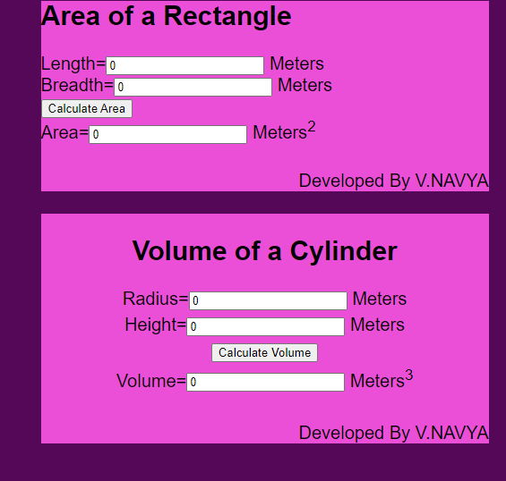

# AngularCalculation

# Web Page for Mathematical Calculations using Angular

## AIM:
To design a dynamic website to perform mathematical calculations using Angular Framwork

## DESIGN STEPS:

### Step 1:

Requirement collection.

### Step 2:

Creating the layout using HTML and CSS in component.html file

### Step 3:

Write typescript to perform the calculations.

### Step 4:

Validate the layout in various browsers.

### Step 5:

Validate the HTML code.

### Step 6:

Publish the website in the given URL.

## PROGRAM :
~~~
app.component.html
Math Calculations
Developed By V.NAVYA
Developed By V.NAVYA
app.component.css
{ box-sizing:border-box; font-family: Arial, Helvetica, sans-serif; } body { background-color:rgb(84, 8, 87); } .container { width:1080px; margin-left: auto; margin-right: auto; padding-left: 300px; max-height:max-content; background-color:rgb(84, 8, 87); padding-bottom: 45px; ; } .content { display:block; width: 500px; background-color:rgb(236, 79, 215); min-height: 150px; font-size: 20px; position:relative;

} h1{ text-align: center; color:black; }

.footer { display: inline-block; width: 100%; height: 40px; background-color:rgb(236, 79, 215); text-align:right; padding-top: 30px; margin: 0px 0px 0px 0px; color: #000000; }

app.component.ts
import { Component } from '@angular/core';

@Component({ selector: 'app-root', templateUrl: './app.component.html', styleUrls: ['./app.component.css'] }) export class AppComponent { title = 'mathcalculations'; }

Rectangle.component.html
Area of a Rectangle
Length= Meters
Breadth= Meters

Area= Meters2
Rectangle.component.css
{ box-sizing: border-box; font-family: Arial, Helvetica, sans-serif; } .container { width: 1080px; margin-left: auto; margin-right: auto; padding-top: 30px; padding-left: 300px; padding-bottom: 500px; } .content { display:block; width: 500px; background-color:white; min-height: 150px; font-size: 20px; } h2{ text-align: center; padding-top: 25px; } .formelement{ text-align: center; margin-top: 5px; margin-bottom: 5px; }
Rectangle.component.ts
import { Component } from "@angular/core"
@Component({ selector: 'Rectanglr-Area', templateUrl:'./rectangle.component.html', styleUrls:['./rectangle.component.css'] }) export class RectangleComponent{ length:number; breadth:number; area:number; constructor(){ this.length=0; this.breadth=0; this.area =this.length * this.breadth;

}
onCalculate()
{
    this.area =  this.length * this.breadth;
}
}

Cylinder.component.html
Volume of a Cylinder
Radius= Meters
Height= Meters

Volume= Meters3
Cylinder.component.css
{ box-sizing: border-box; font-family: Arial, Helvetica, sans-serif; } h2{ text-align: center; padding-top: 25px; } .formelement{ text-align: center; margin-top: 5px; margin-bottom: 5px; }

Cylinder.component.ts
import { style } from "@angular/animations"; import { Component } from "@angular/core"

@Component({ selector: 'Cylinder-Volume', templateUrl:'./cylinder.component.html', styleUrls:['./cylinder.component.css']

}) export class CylinderComponent{ radius:number; height:number; volume:number; constructor(){ this.radius=0; this.height=0; this.volume =3.14 * this.radius * this.radius * this.height ;

}
onCalculate()
{
    this.volume = 3.14 * this.radius * this.radius * this.height ;
}
}
~~~
## OUTPUT:

## Result:
This the code is executed successfully.
